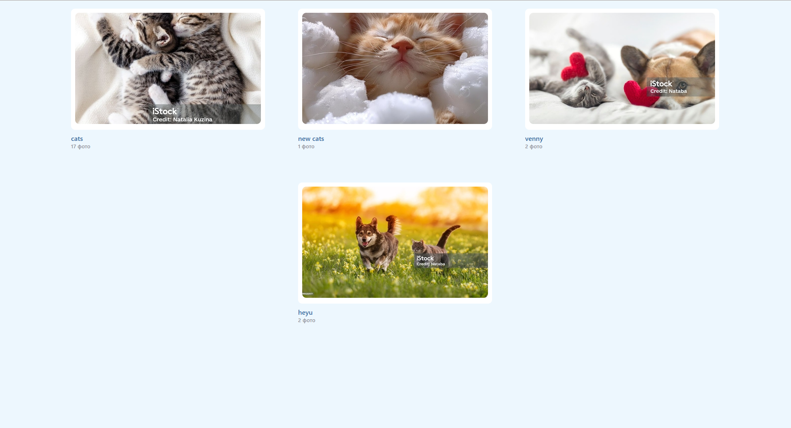
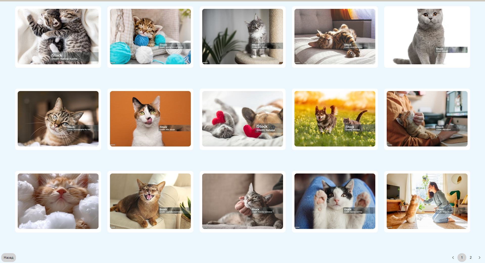
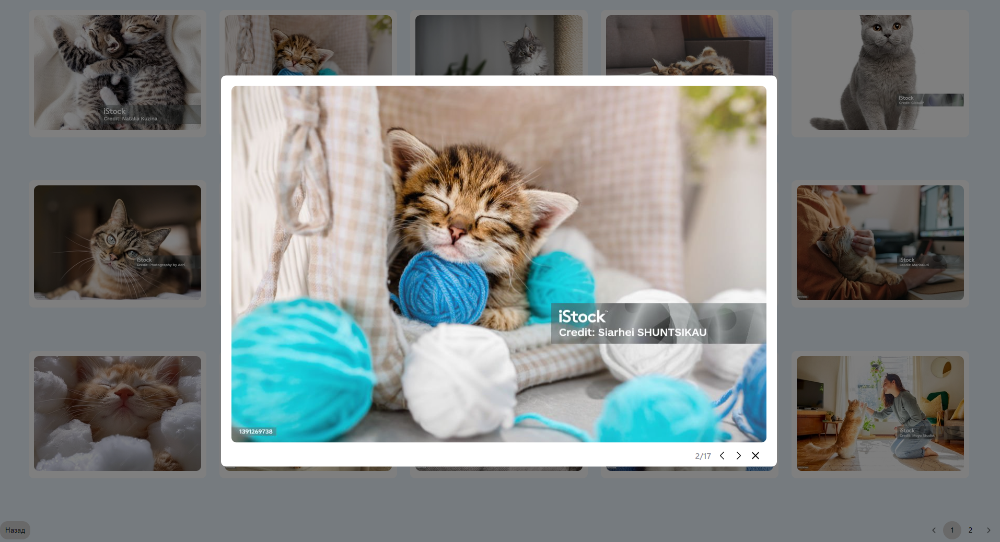

# Сайт-галерея

## Описание проекта
Этот проект представляет собой веб-сайт галереи, на который администраторы могут загружать фотографии, используя автономный сервер Directus. 
Затем посетители могут просматривать эти фотографии в альбомах, что упрощает работу с ними.

### Особенности:
- Серверная часть работает на автономном хостинге Directus.
- Загрузка фотографий осуществляется через панель администратора Directus (доступна по адресу: [http://localhost:8055](http://localhost:8055)).
- Интерфейсное приложение, помещенное в контейнер Docker с конфигурацией Docker Compose для простого развертывания вместе с Directus.
- Реализован механизм создания альбомов для упорядочивания фотографий.
- Пагинация по фотографиям.
- Адаптивный дизайн обеспечивает согласованность макета независимо от размеров изображения или соотношения сторон.
- Настраиваемый маршрут для удобного обмена ссылками на альбомы и фотографии.
- Поддержка миниатюр обеспечивает эффективную загрузку изображений без изменения размера на стороне клиента.
- Так же добавлена функциональность закрытия модального окна по нажатию вне фотографии. Это сделано на собственное усмотрение и может быть легко убрано

## Инструкция по запуску приложения:

1. Клонируйте репозиторий:
   ```bash
   git clone git@github.com:glush-chenko/gallery.git

2. Убедитесь, что у вас установлен [Docker](https://docs.docker.com/get-docker/)

3. Соберите и запустите контейнеры:
- Для Directus перейдите в каталог ./directus и запустите:
   ```bash
   docker compose up 
  
- Для frontend части перейдите в каталог ./client и запустите:
   ```bash
   docker build -t your-name . 
   docker run -p 3000:3000 your-name
  
4. Откройте браузер и перейдите по адресу [http://localhost:3000](http://localhost:3000) для доступа к frontend.

5. Для доступа к админке Directus откройте [http://localhost:8055](http://localhost:8055) и войдите с помощью следующих учетных данных:

- **Логин:** `admin@example.com`
- **Пароль:** `d1r3ctu5`

*по умолчанию загружать картинки необходимо в библиотеку файлов, затем добавлять их в основную коллекцию Albums*

### Скриншоты:






